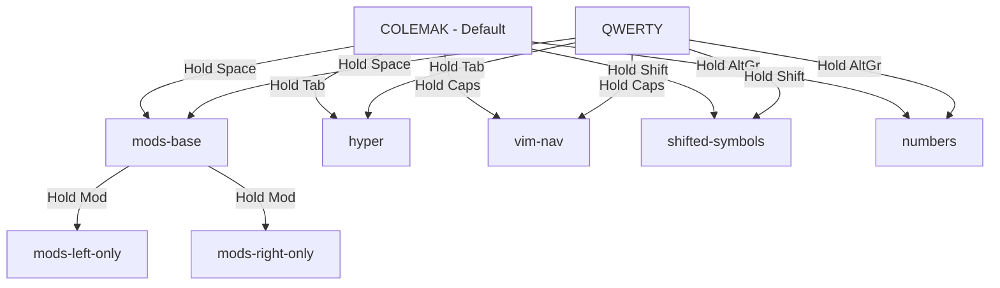

# Kanata Keyboard Layers Visual Cheatsheet

## 📋 Layer Overview



## ⌨️ COLEMAK Layer (Default)

```
┌─────┬─────┬─────┬─────┬─────┬─────┬─────┬─────┬─────┬─────┬─────┬─────┬─────┬─────┐
│ ESC │ F1  │ F2  │ F3  │ F4  │ F5  │ F6  │ F7  │ F8  │ F9  │ F10 │ F11 │ F12 │ DEL │
├─────┼─────┼─────┼─────┼─────┼─────┼─────┼─────┼─────┼─────┼─────┼─────┼─────┼─────┤
│  `  │  !  │  "  │  #  │  $  │  %  │  &  │  /  │  (  │  )  │  =  │  +  │  ´  │BSPC │
│     │ S-1 │ S-2 │ S-3 │AG-4 │ S-5 │ S-6 │ S-7 │ S-8 │ S-9 │ S-0 │     │     │     │
├─────┼─────┼─────┼─────┼─────┼─────┼─────┼─────┼─────┼─────┼─────┼─────┼─────┼─────┤
│TAB* │  Q  │  W  │  F  │  P  │  G  │  J  │  L  │  U  │  Y  │  Ö  │  Å  │  ^  │ RET │
│     │     │     │     │     │     │     │     │     │     │     │     │ S-¨ │     │
├─────┼─────┼─────┼─────┼─────┼─────┼─────┼─────┼─────┼─────┼─────┼─────┼─────┴─────┤
│CAPS†│  A  │  R  │  S  │  T  │  D  │  H  │  N  │  E  │  I  │  O  │  Ä  │     '     │
├─────┼─────┼─────┼─────┼─────┼─────┼─────┼─────┼─────┼─────┼─────┼─────┼───────────┤
│LSFT‡│  <  │  Z  │  X  │  C  │  V  │  B  │  K  │  M  │  ,  │  .  │  -  │   RSFT‡   │
├─────┼─────┼─────┼─────┴─────┴─────┴─────┴─────┴─────┼─────┼─────┼─────┼───────────┤
│LCTL │LMET │LALT │            SPACE                  │RALT │RCTL │     │           │
└─────┴─────┴─────┴───────────────────────────────────┴─────┴─────┴─────┴───────────┘

*TAB: Tap=Tab | Hold=Hyper layer
†CAPS: Tap=ESC | Hold=Vim Nav | Double-tap=CAPS
‡SHIFT: Also activates shifted-symbols layer
§SPACE: Tap=Space | Hold=Home Row Mods layer
¶RALT: Also activates numbers layer

Number row: ! " # $ % & / ( ) = (Nordic symbols via Shift/AltGr)
```

## ⌨️ QWERTY Layer

```
┌─────┬─────┬─────┬─────┬─────┬─────┬─────┬─────┬─────┬─────┬─────┬─────┬─────┬─────┐
│ ESC │ F1  │ F2  │ F3  │ F4  │ F5  │ F6  │ F7  │ F8  │ F9  │ F10 │ F11 │ F12 │ DEL │
├─────┼─────┼─────┼─────┼─────┼─────┼─────┼─────┼─────┼─────┼─────┼─────┼─────┼─────┤
│  `  │  !  │  "  │  #  │  $  │  %  │  &  │  /  │  (  │  )  │  =  │  +  │  ´  │BSPC │
│     │ S-1 │ S-2 │ S-3 │AG-4 │ S-5 │ S-6 │ S-7 │ S-8 │ S-9 │ S-0 │     │     │     │
├─────┼─────┼─────┼─────┼─────┼─────┼─────┼─────┼─────┼─────┼─────┼─────┼─────┼─────┤
│TAB* │  Q  │  W  │  E  │  R  │  T  │  Y  │  U  │  I  │  O  │  P  │  Å  │  ^  │ RET │
│     │     │     │     │     │     │     │     │     │     │     │     │ S-¨ │     │
├─────┼─────┼─────┼─────┼─────┼─────┼─────┼─────┼─────┼─────┼─────┼─────┼─────┴─────┤
│CAPS†│  A  │  S  │  D  │  F  │  G  │  H  │  J  │  K  │  L  │  Ö  │  Ä  │     '     │
├─────┼─────┼─────┼─────┼─────┼─────┼─────┼─────┼─────┼─────┼─────┼─────┼───────────┤
│LSFT‡│  <  │  Z  │  X  │  C  │  V  │  B  │  N  │  M  │  ,  │  .  │  -  │   RSFT‡   │
├─────┼─────┼─────┼─────┴─────┴─────┴─────┴─────┴─────┼─────┼─────┼─────┼───────────┤
│LCTL │LMET │LALT │            SPACE                  │RALT¶│RCTL │     │           │
└─────┴─────┴─────┴───────────────────────────────────┴─────┴─────┴─────┴───────────┘

Same modifiers as Colemak, only letter positions change
```

## 🏠 HOME ROW MODS Layer (Space-activated)

```
┌─────┬─────┬─────┬─────┬─────┬─────┬─────┬─────┬─────┬─────┬─────┬─────┬─────┬─────┐
│ ESC │ F1  │ F2  │ F3  │ F4  │ F5  │ F6  │ F7  │ F8  │ F9  │ F10 │ F11 │ F12 │ DEL │
├─────┼─────┼─────┼─────┼─────┼─────┼─────┼─────┼─────┼─────┼─────┼─────┼─────┼─────┤
│  `  │  !  │  "  │  #  │  $  │  %  │  &  │  /  │  (  │  )  │  =  │  +  │  ´  │BSPC │
├─────┼─────┼─────┼─────┼─────┼─────┼─────┼─────┼─────┼─────┼─────┼─────┼─────┼─────┤
│ ___ │  Q  │  W  │  E  │  R  │  T  │  Y  │  U  │  I  │  O  │  P  │  Å  │  ^  │ RET │
├─────┼─────┼─────┼─────┼─────┼─────┼─────┼─────┼─────┼─────┼─────┼─────┼─────┴─────┤
│ ___ │  A  │  S  │  D  │  F  │  G  │  H  │  J  │  K  │  L  │  Ö  │  Ä  │     '     │
│     │ ⌘met│ ⌃ctl│ ⌥alt│ ⇧sft│     │     │ ⇧sft│ ⌥alt│ ⌃ctl│ ⌘met│     │           │
├─────┼─────┼─────┼─────┼─────┼─────┼─────┼─────┼─────┼─────┼─────┼─────┼───────────┤
│LSFT │  <  │  Z  │  X  │  C  │  V  │  B  │  N  │  M  │  ,  │  .  │  -  │    RSFT   │
├─────┼─────┼─────┼─────┴─────┴─────┴─────┴─────┼─────┼─────┼─────┼─────┼───────────┤
│LCTL │LMET │LALT │         SPACE(held)         │RALT │RCTL │     │     │           │
└─────┴─────┴─────┴─────────────────────────────┴─────┴─────┴─────┴─────┴───────────┘

NOTE: All letters output QWERTY positions (Q,W,E,R,T not Q,W,F,P,G)
```

## 🤚 Same-Hand Restriction Layers

### MODS-LEFT-ONLY (When left mod held while in mods layer)
```
Home Row (QWERTY positions):
├─────┼─────┼─────┼─────┼─────┼─────┼─────┼─────┼─────┼─────┼─────┼
│ ___ │  A  │  S  │  D  │  F  │ ___ │ ___ │  j  │  k  │  l  │  ö  │
│     │ ⌘met│ ⌃ctl│ ⌥alt│ ⇧sft│     │     │plain│plain│plain│plain│
├─────┼─────┼─────┼─────┼─────┼─────┼─────┼─────┼─────┼─────┼─────┼
                    ↑                         ↑
            Left mods active           Right keys = letters only
```

### MODS-RIGHT-ONLY (When right mod held while in mods layer)
```
Home Row (QWERTY positions):
├─────┼─────┼─────┼─────┼─────┼─────┼─────┼─────┼─────┼─────┼─────┼
│ ___ │  a  │  s  │  d  │  f  │ ___ │ ___ │  J  │  K  │  L  │  Ö  │
│     │plain│plain│plain│plain│     │     │ ⇧sft│ ⌥alt│ ⌃ctl│ ⌘met│
├─────┼─────┼─────┼─────┼─────┼─────┼─────┼─────┼─────┼─────┼─────┼
                    ↑                         ↑
            Left keys = letters only    Right mods active
```

## 🔢 NUMBERS Layer (AltGr-activated)

```
Number Row Only:
├─────┼─────┼─────┼─────┼─────┼─────┼─────┼─────┼─────┼─────┼─────┼
│ ___ │  1  │  2  │  3  │  4  │  5  │  6  │  7  │  8  │  9  │  0  │
├─────┼─────┼─────┼─────┼─────┼─────┼─────┼─────┼─────┼─────┼─────┼

¨ key → plain ¨
```

## 🔣 SHIFTED-SYMBOLS Layer (Shift-activated)

```
Number Row Only:
├─────┼─────┼─────┼─────┼─────┼─────┼─────┼─────┼─────┼─────┼─────┼
│ ___ │  !  │  @  │  #  │  $  │  %  │  ^  │  &  │  *  │  (  │  )  │
│     │AG-1 │AG-2 │AG-3 │ S-4 │AG-5 │AG-6 │AG-7 │AG-8 │AG-9 │AG-0 │
├─────┼─────┼─────┼─────┼─────┼─────┼─────┼─────┼─────┼─────┼─────┼

¨ key → AltGr+¨
```

## 🎮 VIM-NAV Layer (Caps-hold)

```
┌─────┬─────┬─────┬─────┬─────┬─────┬─────┬─────┬─────┬─────┬─────┬
│ ___ │ ___ │ ___ │ ___ │ ___ │ ___ │PgDn │ C-↓ │ C-↑ │PgUp │ ___ │
├─────┼─────┼─────┼─────┼─────┼─────┼─────┼─────┼─────┼─────┼─────┼
│ ___ │ ___ │ ___ │ ___ │ ___ │ ___ │ ←   │ ↓   │ ↑   │ →   │ ___ │
├─────┼─────┼─────┼─────┼─────┼─────┼─────┼─────┼─────┼─────┼─────┼
│ ___ │ ___ │ ___ │C-S-x│ ___ │ ___ │ ___ │ ___ │HOME │ END │ ___ │
├─────┼─────┼─────┼─────┼─────┼─────┼─────┼─────┼─────┼─────┼─────┼

Physical positions: HJKL → arrows, Y → PgDn, U → C-↓, I → C-↑, O → PgUp, X → C-S-x
```

## 🚀 HYPER Layer (Tab-hold)

```
All alphanumeric keys → Hyper + Key
Hyper = Ctrl+Shift+Alt+Meta

┌─────┬─────┬─────┬─────┬─────┬─────┬─────┬─────┬─────┬─────┬─────┬
│H+ESC│ ___ │ ___ │ ___ │ ___ │ ___ │ ___ │ ___ │ ___ │ ___ │ ___ │
├─────┼─────┼─────┼─────┼─────┼─────┼─────┼─────┼─────┼─────┼─────┼
│ ___ │ H+1 │ H+2 │ H+3 │ H+4 │ H+5 │ H+6 │ H+7 │ H+8 │ H+9 │ H+0 │
├─────┼─────┼─────┼─────┼─────┼─────┼─────┼─────┼─────┼─────┼─────┼
│ ___ │ H+Q │ H+W │ H+E │ H+R │ H+T │ H+Y │ H+U │ H+I │ H+O │ H+P │
├─────┼─────┼─────┼─────┼─────┼─────┼─────┼─────┼─────┼─────┼─────┼
│ ___ │ H+A │ H+S │ H+D │ H+F │ H+G │ H+H │ H+J │ H+K │ H+L │ ___ │
├─────┼─────┼─────┼─────┼─────┼─────┼─────┼─────┼─────┼─────┼─────┼
│ ___ │ ___ │ H+Z │ H+X │ H+C │ H+V │ H+B │ H+N │ H+M │ ___ │ ___ │
├─────┼─────┼─────┼─────┼─────┼─────┼─────┼─────┼─────┼─────┼─────┼
```

## ⏱️ Timing Configuration

```
HOME ROW MOD TIMINGS:
┌────────────┬──────────┬───────────┐
│   Finger   │ Tap Time │ Hold Time │
├────────────┼──────────┼───────────┤
│ Index (F/J)│   75ms   │   120ms   │
│ Middle(D/K)│   85ms   │   150ms   │
│ Ring  (S/L)│   85ms   │   150ms   │
│ Pinky (A/Ö)│  100ms   │   180ms   │
└────────────┴──────────┴───────────┘

OTHER KEYS:
• Tab-Hyper: 50ms tap / 175ms hold
• Caps-Multi: 50ms tap / 175ms hold / 175ms double-tap
• Space-Mods: 50ms tap / 175ms hold (120ms recent key check)
```

## 🎯 Quick Reference

### Key Behaviors
- **Space**: Tap = Space | Hold = Activate home row mods
- **Tab**: Tap = Tab | Hold = Hyper layer (all keys become Hyper+key)
- **Caps**: Tap = ESC | Hold = Vim navigation | Double-tap = Caps Lock
- **Shift**: Normal shift + activates shifted-symbols on number row
- **AltGr**: Normal AltGr + activates plain numbers on number row

### Number Row Special Behavior
- **Default**: Nordic symbols (! " # $ % & / ( ) =)
- **With Shift held**: Different symbols (@ for 2, ^ for 6, * for 8, etc.)
- **With AltGr held**: Plain numbers (1 2 3 4 5 6 7 8 9 0)

### Home Row Mods Rules
1. **Only active when holding Space**
2. **Same-hand restriction**: When holding a mod, only that hand's mods work
3. **All letters output QWERTY positions** regardless of active layout
4. **Fast typing bypasses mods** (keys within 120ms = letters only)
